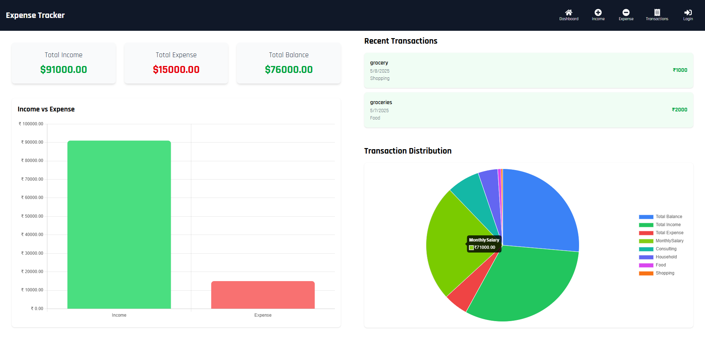

# Expense Tracker

A simple yet powerful application to track your personal expenses and income.


## Features

- Add, edit, and delete transactions
- Categorize expenses/income
- View transaction history
- Generate reports and statistics
- Budget tracking
- Data export/import

## Technologies Used

- Frontend: React.js
- Backend: Node.js/Express
- Database: SQLite (or MongoDB)
- Charting: Chart.js
- Styling: CSS/Tailwind

## Installation

1. Clone the repository:
```bash
git clone https://github.com/yourusername/expensetracker.git

Install dependencies:
cd expensetracker
*********************************
cd frontend
npm install
*********************************
cd ../backend
npm install

Set up environment variables:
Create a .env file in the backend directory with your configuration.

Run the application:
cd frontend
npm start
*********************************

## Configuration
The application requires the following environment variables:

- PORT - Server port (default: 3000)
- DB_PATH - Database file path
- JWT_SECRET - Secret for authentication


## Contributing
Pull requests are welcome. For major changes, please open an issue first to discuss what you would like to change.