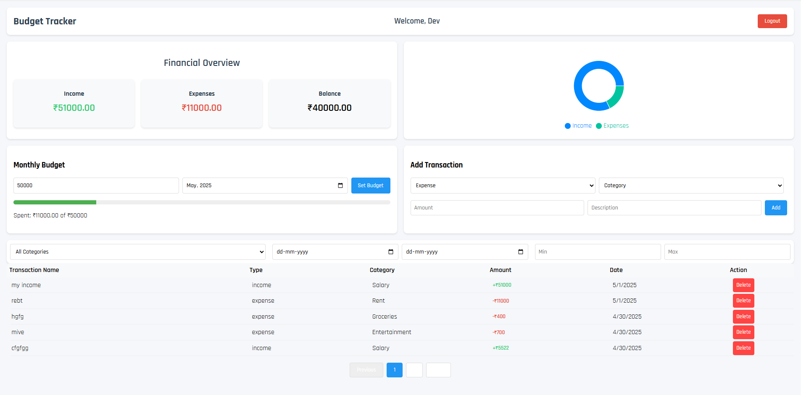

## Features
- User Authentication (Login/Register)
- Dashboard with financial overview
- Income and Expense tracking
- Monthly budget management
- Interactive charts and visualizations
- Transaction filtering and pagination
- Responsive design for all devices
- Real-time calculations and updates

## Technologies & Libraries Used

### Frontend
- React.js - UI library
- React Router - Navigation
- Recharts - Data visualization
- CSS3 - Styling and animations

### Backend
- Node.js & Express.js - Server framework
- MongoDB - Database
- JWT - Authentication
- Bcrypt.js - Password hashing
- Cors - Cross-origin resource sharing

## Feature Assumptions
1. Users can set only one budget per month
2. Transactions cannot be edited (only added/deleted)
3. All amounts are in Indian Rupees (₹)
4. Categories are predefined and cannot be customized
5. Data is displayed in chronological order
6. Session expires after 24 hours

## API Endpoints
- Authentication: `/api/auth/login`, `/api/auth/register`
- Transactions: `/api/transactions`
- Budget: `/api/budget`
- User Profile: `/api/users/me`

## Local Development
1. Clone the repository
2. Install dependencies: `npm install`
3. Start development server: `npm start`
4. Backend runs on: `https://expense-tracker-4mo8.onrender.com`
5. Frontend runs on: `http://localhost:3000 || https://expense-tracker-01-tau.vercel.app/`

## Deployment
- Frontend: Vercel
- Backend: Render
- Database: MongoDB Atlas

